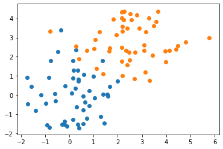
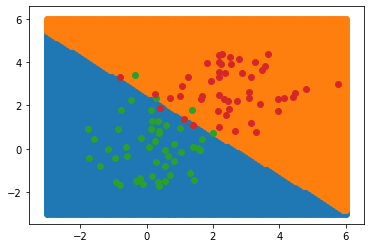
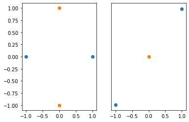

# Recitation 3

### Homework Tips

* Be familiar with the [What Can I Ask On Diderot?](www.diderot.one/course/10/dosts/?is_inbox=yes&dost=4658) policy
* Talk to other students taking the course -- they can help you and you can help them.
* Feel free to meet other students during the Collaboration Space -- every Tuesday in GHC 4303.
* Look for the "Common Problems in Homework x" post on Diderot before asking questions online.

### TA Hours

* Come this week! Don't wait until the last week.
* Construct a _minimal counter-example_ : a simplest test case that fails.

```python
import numpy as np
import matplotlib.pyplot as plt
from sklearn.linear_model import LinearRegression
```

## Linear Classification

Usually we talk about linear regression: inferring a continuous value as a linear function of input variables. In this homework, we're using linear regression to predict a category variable. Let's see what this looks like on a simple test dataset:

```python
n=50
data = np.concatenate((np.random.normal(size=(n, 2)), np.random.normal(size=(n, 2)) + 2.5))
cls = np.array([-1]*n + [1]*n)

plt.scatter(data[cls==-1,0], data[cls==-1,1])
plt.scatter(data[cls== 1,0], data[cls== 1,1])
```



We fit a simple linear regression model to this data and examine the output. Notice that the output is continuous, not discrete.

```python
model = LinearRegression()
model.fit(data, cls)
pred = model.predict(data)

pred[:5]
```

Let's draw the scatter data and highlight misclassified points:

```python
plt.scatter(data[pred<0,0], data[pred<0,1])
plt.scatter(data[pred>0,0], data[pred>0,1])

# Plot misclassified points:
errs = ((cls==-1) & (pred>0)) | ((cls==1) & (pred<0)) 
plt.scatter(data[errs,0], data[errs,1])
```


Lets visualize the classifier using regularly-spaced points:

```python
xx, yy = np.meshgrid(np.linspace(-3, 6, 101), np.linspace(-3, 6, 101))
grid = np.vstack([xx.ravel(), yy.ravel()]).T
ccls = model.predict(grid)
plt.scatter(grid[ccls<0,0], grid[ccls<0,1])
plt.scatter(grid[ccls>0,0], grid[ccls>0,1])

# Post the original data division as well:
plt.scatter(data[cls==-1,0], data[cls==-1,1])
plt.scatter(data[cls== 1,0], data[cls== 1,1])
```



Notice that the class boundary is a line; this is characteristic of a linear classifier. We cannot separate classes like these using a linear classifier:

```python
plt.subplot(1, 2, 1)
plt.scatter([-1, 1], [0, 0])
plt.scatter([0, 0], [-1, 1])

plt.subplot(1, 2, 2)
plt.yticks([])
plt.scatter([-1, 1], [-1, 1])
plt.scatter([0], [0])
```



## F1 vs Accuracy

In `hw3_text`, we introduce the $F\_1$-score to measure the performance of a binary classifier. We define this in terms of the number of true and false positives and negatives in our classifier.

| | Predicted | Actual |
|-| --------- | ------ |
| true positive | T | T |
| false positive | T | F |
| false negative | F | T |
| true negative | F | F |

To calculate the $F\_1$ score, we can calculate:
$$
\begin{align*}
\text{precision} & \gets \frac{\text{true positive}}{\text{true positive} + \text{true negative}}
\\ \text{recall} & \gets \frac{\text{true positive}}{\text{true positive} + \text{false positive}}
\\ F_1\text{ score} & \gets 2 \cdot \frac{\text{precision} \cdot \text{recall}}{\text{precision} + \text{recall}}
\end{align*}
$$

### Why?

We care about this because it works when you want to measure classifier performance on rare events.

For example, lets look at a pair of ficticious medical test in a population where 1% of people have some disorder.

When *Zico's Magic Classifier* (ZMC) and the much simpler *Always False Classifier* (AFC) are run on 1000 people, they both obtain 99% accuracy. Here are the confusion matrices for both:

| Always False Classifier | Actual True | Actual False |
| --------------- | ----------- | ------------ |
| Predicted True  | 0           | 0            |
| Predicted False | 10          | 990          |


| Zico's Magic Classifier | Actual True | Actual False |
| --------------- | ----------- | ------------ |
| Predicted True  | 10          | 10           |
| Predicted False | 0           | 980          |

The accuracy for both classifiers is 99%, despite AFC not depending on the data (and consequently being useless). In this example, accuracy does not tell us which classifier is better.

Let's calculate the $F\_1$ score for both classifiers:

|     | Precision | Recall | $F\_1$ score |
| --- | --------- | ------ | ----------- |
| ATC | $\frac{0}{0}$ | $\frac{0}{10}$ | $0$ or `NaN` |
| ZMC | $\frac{10}{20}$ | $\frac{10}{10}$ | $\frac{2}{3}$

The $F\_1$ score is good when you want measure your classifier's performance on catching rare events.
