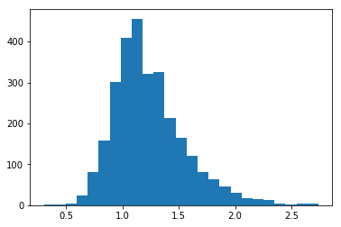
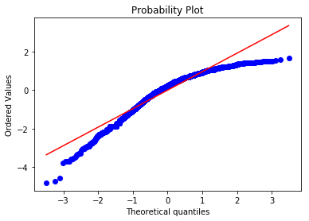
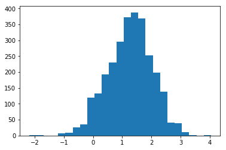
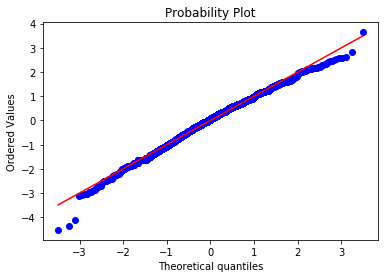
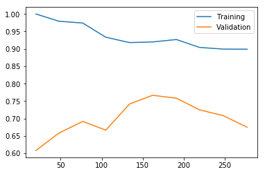

# Walkthrough

```python
import requests
from bs4 import BeautifulSoup

import pandas as pd
import numpy as np
import matplotlib.pyplot as plt
import IPython.display as display
%matplotlib inline
```

## Data collection

```python
url = "https://www.amazon.com/s/ref=sr_nr_p_72_3?fst=as%3Aoff&rh=n%3A165793011%2Cn%3A%21165795011%2Cn%3A196601011%2Cp_n_age_range%3A165813011%2Cp_72%3A1248966011&bbn=196601011&ie=UTF8&qid=1524683296&rnid=1248961011"
```

```python
response = requests.get(url)
```

```python
headers = {
    'User-Agent':'Mozilla/5.0 (Macintosh; Intel Mac OS X 10_10_3) AppleWebKit/537.36 (KHTML, like Gecko) Chrome/54.0.2840.71 Safari/537.36'
}
response = requests.get(url, headers=headers)
```

```python
root = BeautifulSoup(response.text, "html5lib")
```

```python
items = root.find_all("div", class_="s-item-container")
```

```python
print(items[1].find("img")["src"])
print(items[1].find("a", class_="s-access-detail-page").text)
print(items[1].find("span", class_="sx-price-whole").text)
print(items[1].find("sup", class_="sx-price-fractional").text)
print(items[1].find("i", class_="a-icon-star").text)
print(items[1].find("a", {"href":lambda x : x.endswith("#customerReviews")}).text)

```

<pre>
https://images-na.ssl-images-amazon.com/images/I/41n-1nusieL._AC_US160_.jpg
The First Years Stack Up Cups
3
99
4.8 out of 5 stars
1,798

</pre>


```python
response2 = requests.get(items[1].find("img")["src"], headers=headers)
display.Image(data=response2.content)
```

```python
[x.find("a")["href"] for x in root.find_all("span", class_="pagnLink")][0]
```

```python
import pickle
```

```python
# ....
urls = []
all_items = []
with open("output.pkl", "rb") as f:
    while True:
        try:
            urls.append(pickle.load(f, encoding='bytes'))
            all_items += pickle.load(f, encoding='bytes')
        except:
            break
all_items = [{k.decode("utf-8"):v for k,v in item.items()} for item in all_items]        
df = pd.DataFrame(all_items)
```

```python
df.iloc[0]
```

## Visualization and cleaning

```python
df["num_ratings"] = df["num_ratings"].apply(lambda x : float(x.replace(",","")))
df["stars"] = df["stars"].apply(lambda x : float(x.split()[0]))
df["rating"] = (df["stars"]-1)/4
```

```python
plt.hist(np.log10(df["num_ratings"]), bins=25)
```


```python
plt.hist(df["rating"], bins=25)
```


```python
plt.scatter(np.log10(df["num_ratings"]), df["rating"])
```


```python
df["bayes_rating"] = (df["rating"]*df["num_ratings"] + 1)/(df["num_ratings"]+2)
plt.scatter(np.log10(df["num_ratings"]), df["bayes_rating"])
```


```python
plt.hist(np.log10(df["price"][~pd.isnull(df["price"])]), bins=25)
```



```python
df.dropna(subset=["price"], inplace=True)
```

```python
plt.scatter(np.log10(df["price"]), df["bayes_rating"])
```


```python
df.sort_values(by=["bayes_rating"], ascending=False, inplace=True)
```

```python
df = df[df["num_ratings"]>4].copy()
```

## First (rarely successful) take on machine learning

```python
plt.hist(df["bayes_rating"], bins=25)
```


```python
import scipy.stats as stats
```

```python
stats.probplot((df["bayes_rating"] - np.mean(df["bayes_rating"]))/np.std(df["bayes_rating"]),plot=plt)
```



```python
df["logit_rating"] = np.log(df["bayes_rating"]/(1-df["bayes_rating"]))
```

```python
plt.hist(df["logit_rating"], bins=25)
```



```python
stats.probplot((df["logit_rating"] - np.mean(df["logit_rating"]))/np.std(df["logit_rating"]),plot=plt)
```



```python
from sklearn.feature_extraction.text import TfidfVectorizer
tfidf = TfidfVectorizer(min_df=10, max_df=0.3, ngram_range=(1,3))


X_tfidf = tfidf.fit_transform(df["name"]).toarray()
X = np.hstack([X_tfidf, np.log(df[["price"]]).values])
y = df["logit_rating"].values
```

```python
from sklearn.model_selection import train_test_split
X_, X_test, y_, y_test = train_test_split(X, y, test_size = 0.3, random_state=0)
X_train, X_cv, y_train, y_cv = train_test_split(X_, y_, test_size = 0.3, random_state=0)
```

```python
from sklearn.ensemble import GradientBoostingRegressor

clf = GradientBoostingRegressor()
clf.fit(X_train, y_train)
```

```python
print("Training MSE: ", np.mean((clf.predict(X_train) - y_train)**2))
print("Baseline training MSE: ", np.mean((np.mean(y_train) - y_train)**2))
```

<pre>
Training MSE:  0.360494880774
Baseline training MSE:  0.57679763421

</pre>


```python
print("CV MSE: ", np.mean((clf.predict(X_cv) - y_cv)**2))
print("Baseline CV MSE: ", np.mean((np.mean(y_train) - y_cv)**2))
```

<pre>
CV MSE:  0.523013048495
Baseline CV MSE:  0.564067894636

</pre>


```python
print("Test MSE: ", np.mean((clf.predict(X_test) - y_test)**2))
print("Baseline Test MSE: ", np.mean((np.mean(y_train) - y_test)**2))
```

<pre>
Test MSE:  0.58075944376
Baseline Test MSE:  0.612558622219

</pre>


## Playing a game

```python
def display_item(s):
    display.display(display.Image(data = s["img_data"]))
    print(s["name"])
    print("$" + str(np.round(s["price"],3)))

```

```python
def ranking_game():
    it1 = np.random.randint(len(df))
    it2 = np.random.randint(len(df))
    
    display_item(df.iloc[it1])
    print("-------")
    display_item(df.iloc[it2])
    print("-------")
    
    guess = int(input("Which item is rated higher (1/2)?"))
    
    print("True Rating: {} / {}".format(df.iloc[it1]["bayes_rating"], df.iloc[it2]["bayes_rating"]))
    correct = ((guess == 1) and (it1 < it2)) or ((guess == 2) and (it1 > it2))
    print("{}".format("Correct!" if correct else "Incorrect!"))
```

```python
ranking_game()
```

```python
def ranking_game2():
    it1 = np.random.randint(len(df)//10)
    it2 = np.random.randint(len(df)//10) + 9*len(df)//10
    if np.random.rand() < 0.5:
        it1,it2 = (it2,it1)
    
    display_item(df.iloc[it1])
    print("-------")
    display_item(df.iloc[it2])
    print("-------")
    
    guess = int(input("Which item is rated higher (1/2)?"))
    
    print("True Rating: {} / {}".format(df.iloc[it1]["bayes_rating"], df.iloc[it2]["bayes_rating"]))
    correct = ((guess == 1) and (it1 < it2)) or ((guess == 2) and (it1 > it2))
    print("{}".format("Correct!" if correct else "Incorrect!"))
```

```python
ranking_game2()
```

## Classification

```python
idx = ((df["bayes_rating"] > np.percentile(df["bayes_rating"], 90)) |
       (df["bayes_rating"] < np.percentile(df["bayes_rating"], 10))).values
y = df["bayes_rating"] > np.median(df["bayes_rating"])
```

```python
X_, X_test, y_, y_test = train_test_split(X[idx,:], y[idx], test_size = 0.3, random_state=0)
X_train, X_cv, y_train, y_cv = train_test_split(X_, y_, test_size = 0.3, random_state=0)
```

```python
X_train.shape
```

```python
from sklearn.ensemble import GradientBoostingClassifier

clf = GradientBoostingClassifier()
clf.fit(X_train, y_train)
print(clf.score(X_train, y_train))
print(clf.score(X_cv, y_cv))
```

<pre>
0.992779783394
0.7

</pre>


```python
def get_err_samples(clf, X, y, X_cv, y_cv, n_samples):
    clf.fit(X[:n_samples], y[:n_samples])
    return np.array([clf.score(X[:n_samples], y[:n_samples]), clf.score(X_cv, y_cv)])

n_samples = [int(x) for x in np.linspace(20, X_train.shape[0], 10)]
errors = np.array([get_err_samples(clf, X_train, y_train, X_cv, y_cv, n) for n in n_samples])
plt.plot(n_samples, errors[:,0], n_samples, errors[:,1])
plt.legend(["Training", "Validation"])
```


```python
from sklearn.linear_model import LogisticRegression

clf = LogisticRegression()
errors = np.array([get_err_samples(clf, X_train, y_train, X_cv, y_cv, n) for n in n_samples])
plt.plot(n_samples, errors[:,0], n_samples, errors[:,1])
plt.legend(["Training", "Validation"])
```



```python
def get_err_C(clf, X, y, X_cv, y_cv, C):
    clf.C = C
    clf.fit(X, y)
    return np.array([clf.score(X, y), clf.score(X_cv, y_cv)])

C = np.logspace(-4, 4, 50)
errors = np.array([get_err_C(clf, X_train, y_train, X_cv, y_cv, c) for c in C])
plt.semilogx(C, errors[:,0], C, errors[:,1])
plt.legend(["Training", "Validation"])
```


```python
clf = LogisticRegression(C=1.0)
clf.fit(X_train, y_train)
print(clf.score(X_train, y_train))
print(clf.score(X_cv, y_cv))
print(clf.score(X_test, y_test))
```

<pre>
0.898916967509
0.675
0.701754385965

</pre>


```python
feature_names = np.array(tfidf.get_feature_names() + ["++price++"])
```

```python
sorted(zip(feature_names, clf.coef_[0]), key=lambda x : np.abs(x[1]), reverse=True)[:20]
```

## Image features

```python
with open("image_features.npy", "rb") as f:
    X_img = np.load(f)
X = X_img
```

```python
X_, X_test, y_, y_test = train_test_split(X[idx,:], y[idx], test_size = 0.3, random_state=0)
X_train, X_cv, y_train, y_cv = train_test_split(X_, y_, test_size = 0.3, random_state=0)
```

```python
clf = LogisticRegression()
clf.fit(X_train, y_train)
print(clf.score(X_train, y_train))
print(clf.score(X_cv, y_cv))
```

<pre>
1.0
0.6

</pre>


```python
C = np.logspace(-10, 10, 50)
errors = np.array([get_err_C(clf, X_train, y_train, X_cv, y_cv, c) for c in C])
plt.semilogx(C, errors[:,0], C, errors[:,1])
plt.legend(["Training", "Validation"])
```


```python
clf = LogisticRegression(C=1e-4)
clf.fit(X_train, y_train)
print(clf.score(X_train, y_train))
print(clf.score(X_cv, y_cv))
print(clf.score(X_test, y_test))
```

<pre>
0.754512635379
0.616666666667
0.590643274854

</pre>


## Images and text

```python
print(np.linalg.norm(X_tfidf))
print(np.linalg.norm(X_img))
```

<pre>
53.2634959423
4306.66

</pre>


```python
X = np.hstack([X_tfidf, X_img/100, np.log(df[["price"]].values)])
X_, X_test, y_, y_test = train_test_split(X[idx,:], y[idx], test_size = 0.3, random_state=0)
X_train, X_cv, y_train, y_cv = train_test_split(X_, y_, test_size = 0.3, random_state=0)
```

```python
clf = LogisticRegression()
C = np.logspace(-4, 4, 50)
errors = np.array([get_err_C(clf, X_train, y_train, X_cv, y_cv, c) for c in C])
plt.semilogx(C, errors[:,0], C, errors[:,1])
plt.legend(["Training", "Validation"])
```


```python
clf = LogisticRegression(C=0.5)
clf.fit(X_train, y_train)
print(clf.score(X_train, y_train))
print(clf.score(X_cv, y_cv))
print(clf.score(X_test, y_test))
```

<pre>
0.898916967509
0.75
0.783625730994

</pre>


## Finding the best underreviewed toys

```python
# ....
urls = []
all_items = []
with open("output.pkl", "rb") as f:
    while True:
        try:
            urls.append(pickle.load(f, encoding='bytes'))
            all_items += pickle.load(f, encoding='bytes')
        except:
            break
all_items = [{k.decode("utf-8"):v for k,v in item.items()} for item in all_items]        
df0 = pd.DataFrame(all_items)


df0["num_ratings"] = df0["num_ratings"].apply(lambda x : float(x.replace(",","")))
df0["stars"] = df0["stars"].apply(lambda x : float(x.split()[0]))
df0["rating"] = (df0["stars"]-1)/4
```

```python
df_deploy = df0[df0["num_ratings"] <=4].copy()
df_deploy.dropna(subset=["price"], inplace=True)
```

```python
X_deploy = np.hstack([tfidf.transform(df_deploy.name).toarray(), np.log(df_deploy[["price"]].values)])
```

```python
deploy_scores = clf.decision_function(X_deploy)
df_deploy["score"] = deploy_scores
```

```python
df_deploy.sort_values(by=["score"], ascending=False).iloc[:20]["name"]
```
